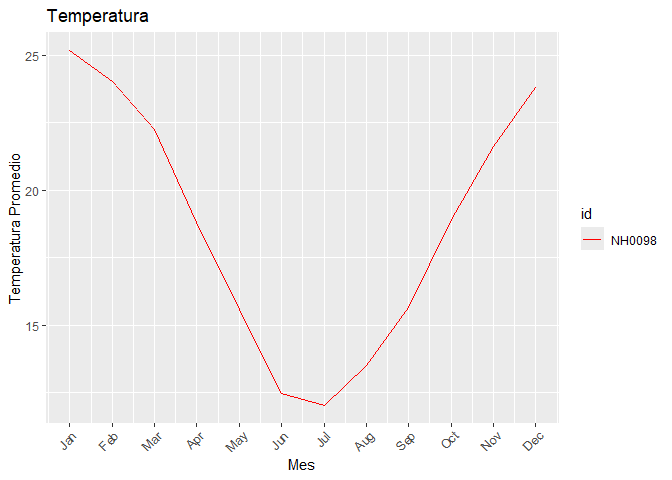

<!-- README.md is generated from README.Rmd. Please edit that file -->

# windyR 

<!-- badges: start -->

[](https://github.com/wenceslao015/windyR/actions/workflows/R-CMD-check.yaml)
<!-- badges: end -->

## Objetivo

El objetivo del paquete es trabajar con datos meteorologicos, pudiendo
crear tablas y gráficos.

## Autores

Este paquete fue creado por [Justo
Borrás](https://github.com/justoborras2006) y [Wenceslao
Tejerina](https://github.com/wenceslao015), ambos estudiantes de la
Licenciatura en Ciencia de Datos Universidad Austral

## Instalación

Se puede instalar la version de windyR desde
[GitHub](https://github.com/) con:

``` r
# install.packages("pak")
pak::pak("wenceslao015/windyR")
#> ✔ Updated metadata database: 5.09 MB in 4 files.
#> ℹ Updating metadata database✔ Updating metadata database ... done
#>  
#> → Will update 1 package.
#> → Will download 1 package with unknown size.
#> + windyR 0.0.0.9000 → 0.0.0.9000 [bld][cmp][dl] (GitHub: 1951ba9)
#> ℹ Getting 1 pkg with unknown size
#> ✔ Got windyR 0.0.0.9000 (source) (5.64 MB)
#> ℹ Packaging windyR 0.0.0.9000
#> ✔ Packaged windyR 0.0.0.9000 (5.9s)
#> ℹ Building windyR 0.0.0.9000
#> ✔ Built windyR 0.0.0.9000 (4.2s)
#> ✔ Installed windyR 0.0.0.9000 (github::wenceslao015/windyR@1951ba9) (91ms)
#> ✔ 1 pkg + 41 deps: kept 34, upd 1, dld 1 (NA B) [26s]
```

## Funciones

1.  **`descarga_datos()`**: Descarga un archivo CSV de datos de una
    estación meteorológica específica desde un repositorio en línea y lo
    guarda en la ruta especificada. Luego, lee el archivo y devuelve los
    datos como un data frame.
2.  **`tabla_de_temperatura_estaciones`** : genera una tabla resumen que
    incluye la temperatura máxima, mínima y promedio por estación a
    partir de un conjunto de datos de temperatura.
3.  **`grafico_mensual`**: Genera un gráfico de líneas que muestra la
    temperatura promedio mensual para cada estación en los datos
    proporcionados. Permite personalizar el título y los colores del
    gráfico.

### Ejemplos de uso

Así es como debería usarse nuestro paquete:

``` r
library(windyR)
```

``` r
NH0098 = descarga_datos("NH0098", "estacion_NH0098.csv")
#> Warning: One or more parsing issues, call `problems()` on your data frame for details,
#> e.g.:
#>   dat <- vroom(...)
#>   problems(dat)
```

``` r
tabla_de_temperatura_estaciones(NH0098)
#> # A tibble: 1 × 4
#>   id     min_temp max_temp mean_temp
#>   <chr>     <dbl>    <dbl>     <dbl>
#> 1 NH0098    -17.4     37.4      18.6
```

``` r
grafico_mensual(NH0098, colores = "red", titulo = "Temperatura")
```



## Contribuciones
