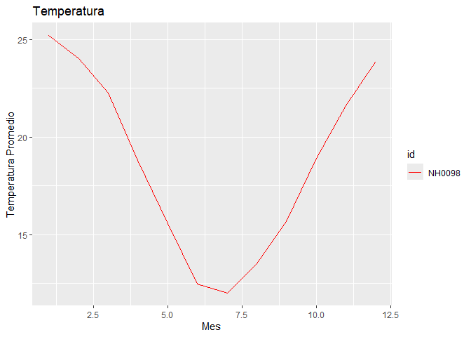

<!-- README.md is generated from README.Rmd. Please edit that file -->

# windyR

<!-- badges: start -->
<!-- badges: end -->

El objetivo de este paquete (“windyR”) es trabajar con datos
meteorologicos. Este paquete fue creado por Justo Borrás y Wenseslao
Tejerina, ambos estudiantes de la Licenciatura en Ciencia de Datos
Universidad Austral

## Instalación

Se puede instalar la version de windyR desde
[GitHub](https://github.com/) con:

``` r
# install.packages("pak")
pak::pak("wenceslao015/windyR")
#> ℹ Loading metadata database✔ Loading metadata database ... done
#>  
#> ℹ No downloads are needed
#> ✔ 1 pkg + 41 deps: kept 34 [5.6s]
library(windyR)
```

## Ejemplo

Esto es un ejemplo sobre una de las funciones basicas de este paquete:

``` r
NH0098 = descarga_datos("NH0098", "estacion_NH0098.csv")
#> Warning: One or more parsing issues, call `problems()` on your data frame for details,
#> e.g.:
#>   dat <- vroom(...)
#>   problems(dat)
#> Rows: 23733 Columns: 35
#> ── Column specification ────────────────────────────────────────────────────────
#> Delimiter: ","
#> chr   (2): id, direccion_viento_1000cm
#> dbl  (21): temperatura_abrigo_150cm, temperatura_abrigo_150cm_maxima, temper...
#> lgl  (11): temperatura_intemperie_50cm_minima, temperatura_inte_5cm, tempera...
#> date  (1): fecha
#> 
#> ℹ Use `spec()` to retrieve the full column specification for this data.
#> ℹ Specify the column types or set `show_col_types = FALSE` to quiet this message.
```

``` r
tabla_de_temperatura_estaciones(NH0098)
#> # A tibble: 1 × 4
#>   id     min_temp max_temp mean_temp
#>   <chr>     <dbl>    <dbl>     <dbl>
#> 1 NH0098    -17.4     37.4      18.6
```

``` r
grafico_mensual(NH0098, colores = "red", titulo = "Temperatura")
```


